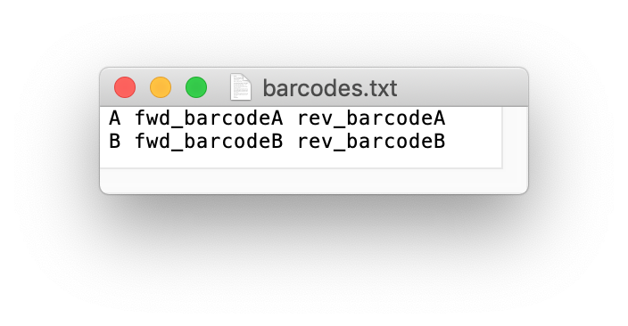

# DeCatCounter

This is the README document for DeCatCounter, a pipeline for processing concatenated PacBio reads from _in vitro_ selection experiments. The pipeline can be used to process nucleotides or amino acids sequencing data.

# Usage

To use the pipeline, type in the terminal:

`python DeCatCounter.py input_file barcodes.txt barc_tol_f barc_tol_r adapters.txt adap_tol_f adap_tol_r translation(y/n) low_len hi_len`

* input_file: name of input file (must include the full path to the directory where it's located).
* barcodes.txt: text file with 3 columns: 1) sample name, 2)corresponding forward barcode, 3) reverse barcode.
* bc_tol_f: error tolerance for forward barcode search in the forward reads(for the reverse reads, this is the error tolerance for the rC of the reverse barcode).
* bc_tol_r: error tolerance for reverse barcode search.
* adapters.txt: text file with 2 lines: 1) forward adapter, 2) reverse adapter.
* ad_tol_f: error tolerance for forward adapter search.
* ad_tol_r: error tolerance for reverse adapter search.
* translation(y/n): whether translation to amino acids should be performed, value should be either y or n. 
* low_len: minimum length for final DNA variants.
* hi_len: maximum length for final DNA variants.

# ADD EXAMPLE OF BARCODE AND ADAPTER TEXT FILES!!!!!!!
# ADD OUTPUT FOR EXAMPLE
# MENTION STOP CODON 

# Dependencies
The pipeline script was written to run on Unix-based systems, like Linux, Ubuntu, and MacOS. Windows 10 also has a [Linux subsystem](https://docs.microsoft.com/en-us/windows/wsl/faq).

To use the pipeline, first install [Python](https://www.python.org/downloads/). We recommend using the Anaconda distribution of python, and adding the Bioconda channel to Anaconda's package manager, conda. See the [Anaconda documentation](https://docs.anaconda.com/anaconda/install/) for installation. 

In order for the pipeline to be called from any directory and for the pipeline to call the translator reliably, both scripts must be placed in a directory that is in the user's PATH environment variable upon download. For example, for Unix/Linux users, scripts could be placed in `/usr/local/bin/` upon download. These files can be placed in that directory with the command:

`cp /path/to/pipeline.sh /usr/local/bin/` 

DeCatCounter must be made executable. This can be done by entering the following commands from the local directory where they are stored:

`chmod +x DeCatCounter.sh`

The pipeline will not be found unless it is stored in the working directory or in a directory that is in the user's PATH environment (e.g. `bin/`). 

# INPUT

All input files (sequencing reads, barcodes and adapters text files) must be located in the same directory.
Sequencing reads are assumed to be in FASTA format. If your sequencing reads file is in FASTQ format, please convert it to fasta using the following command (convert input.fastq to output.fasta):

`cat input.fastq | awk '{if(NR%4==1) {printf(">%s\n",substr($0,2));} else if(NR%4==2) print;}' > output.fasta`

The barcodes files should be a text file with 3 columns: 1) sample name, 2)corresponding forward barcode, 3) reverse barcode. For example:

# Test dataset

A mock, test dataset (test_input.fasta) is provided, together with barcodes and adapter text files (barcodes.txt, adapters.txt).
To run the test dataset, type:

`python DeCatCounter.py test_input.fasta barcodes.txt 0 0 adapters.txt 0 0 y 5 50`
     
# Reporting bugs

Please report any bugs to Celia Blanco (celiablanco@ucla.edu). 

When reporting bugs, please include the full output printed in the terminal when running the pipeline. 

# Citation

Nisha Kanwar\*, Celia Blanco\*, Irene A. Chen and Burckhard Seelig. PacBio sequencing output increased through uniform and directional 5-fold concatenation. *Submitted.*

